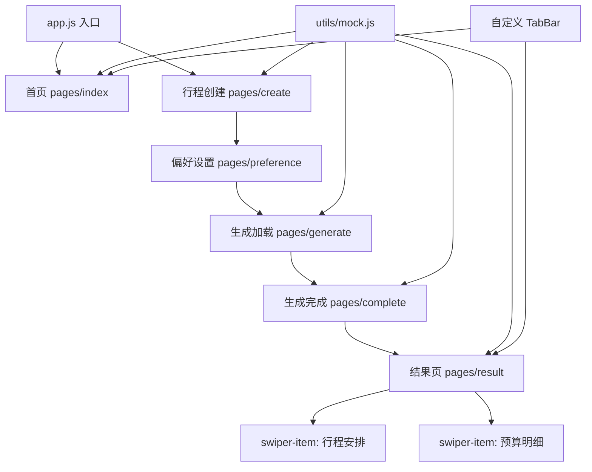

## 用户需求

基于 Calicat 设计稿中的 7 个设计图层数据，使用微信小程序云开发模板构建「AI旅行规划」小程序的全部 6 个前端页面。

## 核心变更

1. **页面合并**：原行程结果页（页面6）与原预算明细页（页面7）合并为 **1 个页面**，使用 `swiper` 组件实现左右滑动切换——左滑显示行程结果时间线，右滑显示预算明细饼图和分类列表。

2. **全 Mock 数据**：所有页面使用本地 Mock 数据（存放在 `utils/mock.js`），不对接后端数据库、不部署云函数。页面间的数据传递通过 `wx.setStorageSync` / `wx.getStorageSync` 本地缓存实现。

3. **后端延后**：前端全部开发完毕后，需输出一份后端 API 接口规范文档（含数据结构、接口路径、请求/响应格式），供后续 Python + Agent 后端开发使用。

## 产品概述

一款 AI 驱动的旅行规划微信小程序，用户通过 3 步引导式表单填写目的地、日期、偏好等信息，模拟 AI 自动生成包含每日行程、预算明细、出行攻略的完整旅行方案。

## 6 个页面核心功能

- **首页**：渐变 Banner 入口、最近规划卡片列表、热门目的地横向滚动、自定义底部 TabBar（首页/我的）
- **行程创建（步骤1）**：步骤指示器、目的地选择器+随机推荐、日期选择器、人数加减器、出行方式 Pill 选项
- **偏好设置（步骤2）**：旅行风格 4 选、兴趣多选标签（8个）、预算档位 4 选、住宿偏好、特殊需求输入、上一步+生成行程按钮
- **AI 生成加载（步骤3）**：脉冲动画 AI 图标、5 步进度列表（分析偏好→检索目的地→规划路线→计算预算→优化行程）、旅行小贴士卡片
- **生成完成**：成功图标+渐变圆、行程预览卡片（D1/D2/D3 概览+总预算）、查看完整行程+重新生成按钮
- **结果页（swiper 双视图）**：
- 左视图=行程安排（日期 Pill 切换、地图区域+导航按钮、每日时间线含上午/中午/下午/晚上分段、推荐书单）
- 右视图=预算明细（总预算渐变头部、Canvas 饼图+图例、分类明细折叠列表、节省预算建议列表）

## 技术栈

- **框架**：微信小程序原生（WXML + WXSS + JS）
- **云服务**：CloudBase 云开发（`wx.cloud.init`），envId=cloud1-d2gzje1i7ba287acb（仅初始化，不操作数据库）
- **图标**：remixicon Unicode 字符（已在设计稿中使用），通过 WXSS `@font-face` 引入 CDN 字体文件
- **图表**：Canvas 2D API 绘制预算环形饼图
- **数据**：`utils/mock.js` 集中管理所有 Mock 数据

## 实现方案

### 整体策略

采用微信小程序原生框架，所有页面使用 Page 模式开发。前端自包含运行，所有数据来自 `utils/mock.js` 中的静态 Mock 数据。页面间通过 URL 参数和 `wx.setStorageSync` 传递表单数据，AI 生成页使用 `setTimeout` + `setInterval` 模拟加载进度。

### 关键技术决策

1. **结果+预算合并**：`pages/result/` 页面内使用 `<swiper>` 组件容纳两个 `<swiper-item>`——左侧行程安排、右侧预算明细。swiper 的 `current` 状态与顶部标签栏联动。
2. **Mock 数据策略**：在 `utils/mock.js` 中集中定义 `mockRecentTrips`、`mockHotDestinations`、`mockTripResult`、`mockBudgetDetail` 等数据集，各页面直接 `import` 使用。
3. **步骤数据传递**：创建页→偏好页→加载页→完成页→结果页，通过 `wx.setStorageSync('tripFormData', {...})` 传递表单数据，`wx.setStorageSync('tripResult', {...})` 传递生成结果。
4. **预算饼图**：结果页 swiper 切换到预算视图时，使用 Canvas 2D API 绘制环形饼图，4 段数据（住宿/餐饮/交通/门票）带不同颜色。
5. **remixicon**：在 `app.wxss` 中使用 `@font-face` 引入 remixicon CDN 字体文件，页面中使用设计稿中的 Unicode 字符（如 `` `` `` `` 等）。

### 性能与兼容性

- 热门目的地横向滚动使用微信小程序原生 `<scroll-view scroll-x>`，性能优于 JS 实现
- 所有尺寸使用 `rpx` 单位确保多机型适配
- Canvas 饼图在 swiper-item 切换时惰性绘制（仅首次进入预算视图时绘制）
- 月度行程时间线数据较长，使用 `<block wx:for>` 高效渲染

### 架构设计



### 数据流

```
用户填写表单(create -> preference)
  → wx.setStorageSync('tripFormData', data)
  → generate 页读取表单，模拟 AI 加载
  → wx.setStorageSync('tripResult', mockResult)
  → complete 页展示预览
  → result 页通过 swiper 双视图展示行程+预算
```

## 目录结构

```
c:/Users/23999/Desktop/前端/
├── miniprogram/
│   ├── app.js                          # 小程序入口，wx.cloud.init 初始化 CloudBase
│   ├── app.json                        # 全局配置，注册 6 个页面路由 + 自定义 TabBar
│   ├── app.wxss                        # 全局 CSS 变量、remixicon @font-face、公共工具类
│   ├── project.config.json             # 项目配置（appid 占位、云开发目录）
│   ├── sitemap.json                    # 搜索配置
│   ├── custom-tab-bar/
│   │   ├── index.wxml                  # 首页/我的 双Tab 布局
│   │   ├── index.wxss                  # 毛玻璃背景、青色选中态
│   │   ├── index.js                    # selected 状态管理、switchTab 跳转
│   │   └── index.json
│   ├── pages/
│   │   ├── index/                      # 首页
│   │   │   ├── index.wxml              # Banner + 最近规划 + 热门目的地
│   │   │   ├── index.wxss
│   │   │   ├── index.js                # 读取 mockRecentTrips/mockHotDestinations
│   │   │   └── index.json
│   │   ├── create/                     # 行程创建页（步骤1/3）
│   │   │   ├── index.wxml              # 步骤指示器 + 目的地/日期/人数/出行方式
│   │   │   ├── index.wxss
│   │   │   ├── index.js                # 表单状态管理，下一步写入 Storage
│   │   │   └── index.json
│   │   ├── preference/                 # 偏好设置页（步骤2/3）
│   │   │   ├── index.wxml              # 旅行风格/兴趣标签/预算/住宿/特殊需求
│   │   │   ├── index.wxss
│   │   │   ├── index.js                # 多选逻辑，合并表单数据后跳转
│   │   │   └── index.json
│   │   ├── generate/                   # AI 生成加载页（步骤3/3）
│   │   │   ├── index.wxml              # AI图标脉冲动画 + 5步进度 + 旅行小贴士
│   │   │   ├── index.wxss              # @keyframes pulse 动画
│   │   │   ├── index.js                # setInterval 模拟进度，完成后跳转
│   │   │   └── index.json
│   │   ├── complete/                   # 生成完成页
│   │   │   ├── index.wxml              # 成功图标 + 行程预览卡片 + 操作按钮
│   │   │   ├── index.wxss
│   │   │   ├── index.js                # 读取生成结果，查看/重新生成按钮
│   │   │   └── index.json
│   │   └── result/                     # 结果页（swiper 双视图：行程+预算）
│   │       ├── index.wxml              # swiper 容器 + 顶部标签栏 + 行程视图 + 预算视图
│   │       ├── index.wxss              # swiper 全屏、时间线样式、饼图容器
│   │       ├── index.js                # swiper 绑定、Canvas 饼图绘制、Tab 联动
│   │       └── index.json
│   ├── components/
│   │   ├── trip-card/                  # 行程卡片（首页最近规划 + 完成页预览）
│   │   ├── dest-card/                  # 目的地卡片（首页横向滚动）
│   │   ├── step-indicator/             # 步骤指示器（create/preference/generate 复用）
│   │   └── timeline-item/              # 时间线单项（result 行程视图复用）
│   └── utils/
│       ├── mock.js                     # 所有 Mock 数据集中管理
│       ├── util.js                     # 工具函数（日期/价格格式化、颜色映射）
│       └── constants.js                # 常量（出行方式、旅行风格、兴趣标签等枚举）
└── backend-api-spec.md                 # 后端 API 接口规范文档（开发完成后输出）
```

采用现代移动端卡片式设计，以青色到蓝色渐变为主色调，传递科技感与旅行的清新感。整体视觉层次分明，大量使用圆角和柔和阴影。

**首页**：Banner 使用青蓝渐变背景+装饰星形 SVG+白色文字。历史行程卡片白底+细灰边框+微阴影+状态标签。热门目的地横向滚动，图片+地名+标签。

**创建页/偏好页**：步骤指示器圆形数字+连接线。表单模块白色卡片+remixicon 图标。Pill 按钮选中态填充主题色。

**加载页**：AI 图标渐变圆形+脉冲阴影动画。进度列表时间线风格，已完成绿色/进行中青色/等待中灰色。

**结果页（swiper）**：左视图=日期 Pill 切换+地图区+时间线（不同时段不同颜色圆点）+行程卡片（图片+描述+贴士框）+书单卡片。右视图=渐变总预算头部+Canvas 饼图+可折叠分类明细+编号建议列表。

**底部导航**：白色背景毛玻璃效果，选中项青色高亮。

## MCP

### CloudBase AI ToolKit

- **用途**：使用 `downloadTemplate` 下载微信小程序云开发模板（miniprogram），初始化项目骨架
- **预期结果**：项目根目录生成 `miniprogram/` 目录结构，包含 `app.js`、`app.json`、`app.wxss`、`project.config.json` 等基础文件

### calicat

- **用途**：设计数据已于前序步骤获取完毕，7 个页面的图层结构、样式属性、文本内容均已就绪
- **预期结果**：无需再次调用，数据直接用于编码参考

## Skill

### miniprogram-development

- **用途**：遵循微信小程序开发规范，确保每个页面包含完整的 `.wxml`/`.wxss`/`.js`/`.json` 四文件结构，TabBar 使用自定义组件模式
- **预期结果**：代码符合微信小程序原生开发标准，组件化合理，路由配置正确

### ui-design

- **用途**：确保 UI 设计严格遵循 Calicat 设计稿，配色使用青蓝渐变（#06B6D4→#3B82F6），图标使用 remixicon，字体使用 PingFang SC
- **预期结果**：所有页面视觉还原度高，与设计稿一致