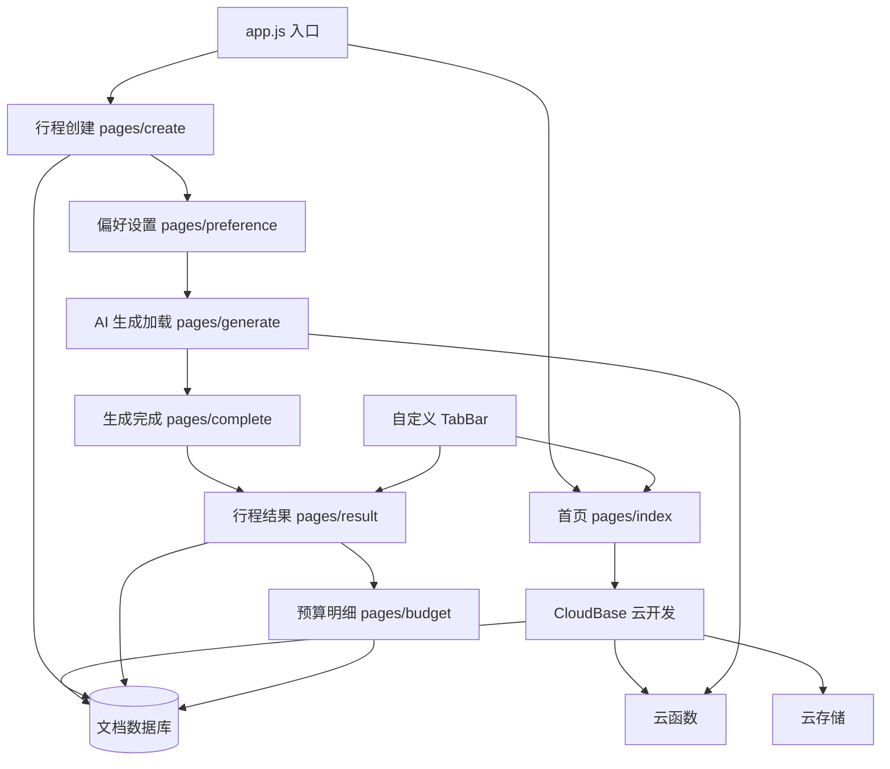

## 用户需求

基于 Calicat 设计稿中的 7 个页面，使用微信小程序云开发构建「AI旅行规划」小程序前端页面。

## 产品概述

一款 AI 驱动的旅行规划微信小程序，用户通过 3 步表单填写目的地、日期、偏好等信息，AI 自动生成包含每日行程、预算明细、出行攻略的完整旅行方案。

## 核心功能

- **首页**：渐变 Banner 入口、最近规划列表、热门目的地横向滚动
- **行程创建**：3 步引导式表单（基本信息 → 偏好设置 → AI 生成）
- **AI 生成**：动画加载页展示生成进度和旅行小贴士
- **行程结果**：时间线式每日行程展示，含地图、景点详情、推荐书单
- **预算明细**：饼图可视化预算构成，分类明细列表，节省建议
- **底部导航**：首页/我的双 Tab 切换

## 技术栈选择

- **框架**：微信小程序原生（WXML + WXSS + JS）
- **云服务**：CloudBase 云开发（`wx.cloud`），envId=cloud1-d2gzje1i7ba287acb
- **数据库**：CloudBase 文档型数据库（NoSQL）
- **存储**：CloudBase 云存储（行程封面图片等）
- **图标**：remixicon（通过 `@font-face` 引入 TTF 字体文件或 SVG 方式）
- **AI 能力**：CloudBase AI（wx.cloud.extend.AI）用于行程生成

## 实现方案

### 整体策略

采用微信小程序原生框架 + CloudBase 云开发的全栈无服务架构。所有页面使用 Page 模式开发，数据通过 `wx.cloud.database()` 直连文档数据库。AI 行程生成通过云函数实现，前端通过轮询或 WebSocket 获取生成结果。

### 关键技术决策

1. **页面拆分**：7 个独立 Page + 1 个自定义 TabBar 组件，对应设计稿中的 7 个页面
2. **数据流**：表单数据通过页面间参数传递和本地缓存（wx.setStorageSync）管理，行程结果持久化到 CloudBase 文档数据库
3. **AI 生成**：使用 CloudBase AI 云函数调用大模型生成行程内容，前端展示加载动画并轮询结果
4. **预算饼图**：使用 Canvas 2D 绘制环形饼图，纯前端实现无需第三方库
5. **remixicon 图标**：将设计稿中使用的 remixicon Unicode 字符通过 WXSS `@font-face` 引入字体文件实现

### 实现注意事项

- **性能**：目的地列表使用虚拟滚动/分页加载，行程结果页使用按需加载（Tab 切换懒加载）
- **兼容**：所有 CSS 使用 rpx 单位确保多机型适配，圆角、阴影等属性注意低版本基础库兼容
- **日志**：关键操作（AI 请求、表单提交）使用 console 记录，生产环境可接入 wx.cloud.logger
- **降级**：AI 生成失败时展示友好提示，允许用户手动填写偏好

## 架构设计



## 目录结构

```
c:/Users/23999/Desktop/前端/
├── miniprogram/
│   ├── app.js                          # [NEW] 小程序入口，wx.cloud.init 初始化，获取用户OPENID
│   ├── app.json                        # [NEW] 全局配置，注册页面路由和自定义 TabBar
│   ├── app.wxss                        # [NEW] 全局样式，CSS 变量定义（颜色、字体、圆角等）
│   ├── project.config.json             # [NEW] 项目配置，appid 和云开发设置
│   ├── sitemap.json                    # [NEW] 搜索配置
│   ├── custom-tab-bar/
│   │   ├── index.wxml                  # [NEW] 自定义底部导航栏模板（首页/我的双Tab）
│   │   ├── index.wxss                  # [NEW] 导航栏样式，毛玻璃效果背景
│   │   ├── index.js                    # [NEW] 导航栏逻辑，选中态切换
│   │   └── index.json                  # [NEW] 组件配置
│   ├── pages/
│   │   ├── index/                      # [NEW] 首页
│   │   │   ├── index.wxml              # 页面结构：Banner、最近规划、热门目的地
│   │   │   ├── index.wxss              # 渐变背景、卡片阴影、横向滚动
│   │   │   ├── index.js                # 数据获取、跳转逻辑
│   │   │   └── index.json              # 页面配置
│   │   ├── create/                     # [NEW] 行程创建页（步骤1）
│   │   │   ├── index.wxml              # 步骤指示器 + 表单（目的地/日期/人数/出行方式）
│   │   │   ├── index.wxss              # 表单卡片、选择器样式
│   │   │   ├── index.js                # 表单数据管理、日期选择、人数加减
│   │   │   └── index.json
│   │   ├── preference/                 # [NEW] 偏好设置页（步骤2）
│   │   │   ├── index.wxml              # 旅行风格、兴趣标签、预算、住宿、特殊需求
│   │   │   ├── index.wxss              # 多选标签、滑动选择器
│   │   │   ├── index.js                # 多选逻辑、预算档位切换
│   │   │   └── index.json
│   │   ├── generate/                   # [NEW] AI 生成加载页（步骤3）
│   │   │   ├── index.wxml              # AI 图标、进度步骤列表、旅行小贴士
│   │   │   ├── index.wxss              # 脉冲动画、步骤状态过渡
│   │   │   ├── index.js                # 调用云函数、轮询状态、动画控制
│   │   │   └── index.json
│   │   ├── complete/                   # [NEW] 生成完成页
│   │   │   ├── index.wxml              # 成功图标、行程预览卡片、操作按钮
│   │   │   ├── index.wxss              # 卡片预览样式
│   │   │   ├── index.js                # 接收结果数据、跳转逻辑
│   │   │   └── index.json
│   │   ├── result/                     # [NEW] 行程结果页（含 Tab 切换）
│   │   │   ├── index.wxml              # 行程头部、标签栏、地图区、每日时间线、推荐书单
│   │   │   ├── index.wxss              # 时间线样式、Tab 切换
│   │   │   ├── index.js                # Tab 切换、数据加载、地图导航
│   │   │   └── index.json
│   │   └── budget/                     # [NEW] 预算明细页
│   │       ├── index.wxml              # 预算头部、饼图、分类明细、节省建议
│   │       ├── index.wxss              # 饼图容器、明细列表
│   │       ├── index.js                # Canvas 2D 绘制饼图、明细展开折叠
│   │       └── index.json
│   ├── components/
│   │   ├── trip-card/                  # [NEW] 行程卡片组件（首页最近规划列表复用）
│   │   │   ├── index.wxml
│   │   │   ├── index.wxss
│   │   │   ├── index.js
│   │   │   └── index.json
│   │   ├── dest-card/                  # [NEW] 目的地卡片组件（热门目的地横向滚动）
│   │   │   ├── index.wxml
│   │   │   ├── index.wxss
│   │   │   ├── index.js
│   │   │   └── index.json
│   │   ├── step-indicator/             # [NEW] 步骤指示器组件（创建页复用）
│   │   │   ├── index.wxml
│   │   │   ├── index.wxss
│   │   │   ├── index.js
│   │   │   └── index.json
│   │   └── timeline-item/              # [NEW] 时间线单项组件（行程结果页复用）
│   │       ├── index.wxml
│   │       ├── index.wxss
│   │       ├── index.js
│   │       └── index.json
│   └── utils/
│       ├── util.js                     # [NEW] 工具函数（日期格式化、价格格式化）
│       ├── constants.js                # [NEW] 常量定义（颜色映射、标签数据）
│       └── api.js                      # [NEW] CloudBase 数据库操作封装
├── cloudfunctions/
│   └── generateTrip/                   # [NEW] AI 行程生成云函数
│       ├── index.js                    # 调用 AI 大模型，生成结构化行程数据
│       ├── package.json                # 依赖配置
│       └── config.json                 # 云函数配置
└── README.md                           # [NEW] 项目说明文档
```

## 关键代码结构

### 数据库集合设计

```javascript
// 集合: trips - 行程记录
{
  _id: "auto",           // 自动生成
  _openid: "user_openid", // 用户标识
  title: "成都3日亲子游",  // 行程标题
  destination: "成都",    // 目的地城市
  startDate: "2024-06-10",
  endDate: "2024-06-12",
  people: 2,             // 人数
  transport: "飞机",      // 出行方式
  style: "轻松休闲",      // 旅行风格
  interests: ["美食探索", "亲子乐园", "博物馆"],
  budget: "comfort",      // 预算档位: economy/comfort/quality/luxury
  accommodation: "舒适型",
  specialNeeds: "",       // 特殊需求
  totalBudget: 3200,     // 总预算
  budgetDetail: {        // 预算明细
    accommodation: { total: 1800, items: [...] },
    food: { total: 900, items: [...] },
    transport: { total: 600, items: [...] },
    tickets: { total: 560, items: [...] }
  },
  dailyPlan: [           // 每日行程
    {
      day: 1,
      date: "2024-06-10",
      periods: [
        {
          timeSlot: "上午",
          items: [
            {
              time: "08:30 - 10:00",
              name: "熊猫基地",
              address: "...",
              description: "...",
              imageUrl: "...",
              tips: "...",
              cost: 55
            }
          ]
        }
      ]
    }
  ],
  status: "completed",   // drafting/loading/completed
  createdAt: Date,
  updatedAt: Date
}
```

### 全局样式变量 (app.wxss)

```css
:root {
  --color-primary: #06B6D4;
  --color-primary-dark: #0891B2;
  --color-blue: #3B82F6;
  --color-bg: #F8FAFC;
  --color-bg-card: #FFFFFF;
  --color-text: #1E293B;
  --color-text-secondary: #64748B;
  --color-success: #22C55E;
  --color-warning: #F59E0B;
  --color-danger: #EF4444;
  --radius-lg: 24rpx;
  --radius-full: 9999rpx;
  --shadow-sm: 0 2rpx 8rpx rgba(0,0,0,0.06);
  --font-family: 'SourceHanSansCN', 'PingFang SC', sans-serif;
}
```

## 设计风格

采用现代移动端卡片式设计，以青色到蓝色渐变为主色调，传递科技感与旅行的清新感。整体视觉层次分明，大量使用圆角和柔和阴影，营造轻盈、友好的用户体验。

## 设计要点

- **首页**：顶部 Banner 使用青蓝渐变背景 + 白色文字 + 装饰星形 SVG，营造视觉焦点。历史行程卡片使用白底 + 细灰边框 + 微阴影，配合状态标签（蓝=已完成/橙=草稿）。热门目的地使用横向滚动卡片，每张卡片含图片 + 地名 + 标签。
- **创建页**：步骤指示器使用圆形数字 + 连接线，当前步骤高亮青色，已完成步骤绿色。表单模块使用白色卡片 + 图标 + 标题，选项使用圆角 Pill 按钮，选中态填充主题色。
- **加载页**：AI 图标使用渐变圆形 + 白色图标，配合脉冲阴影动画。进度步骤列表使用时间线风格，已完成绿色、进行中青色（带脉冲动画）、等待中灰色。
- **结果页**：日期选择器使用 Pill 按钮切换。时间线使用左侧竖线 + 圆点 + 卡片布局，上午/中午/下午/晚上用不同颜色区分。行程卡片内含景点图片、描述、贴士框（黄色背景）。
- **预算页**：顶部总金额使用渐变背景卡片。Canvas 饼图 + 右侧图例。分类明细使用可展开折叠的卡片列表。
- **底部导航**：白色背景 + 毛玻璃效果，当前选中项青色高亮。

## Agent Extensions

### MCP

- **CloudBase AI ToolKit**
- 用途：初始化微信小程序云开发项目、创建数据库集合、部署云函数、管理云存储
- 预期结果：使用 `downloadTemplate` 下载 miniprogram 模板，用 `writeNoSqlDatabaseStructure` 创建 trips 集合，用 `manageFunctions` 部署 generateTrip 云函数

- **calicat**
- 用途：已获取全部 7 个页面的完整设计数据（图层结构、样式属性、文本内容），无需再次调用
- 预期结果：设计数据已就绪，可直接用于编码

### Skill

- **miniprogram-development**
- 用途：遵循微信小程序项目结构和开发规范，确保页面/组件/配置的完整性
- 预期结果：生成的代码符合微信小程序原生开发规范，包含完整的 .wxml/.wxss/.js/.json 四文件结构

- **no-sql-wx-mp-sdk**
- 用途：使用 `wx.cloud.database()` 进行客户端数据读写，遵循集合权限和 _openid 规范
- 预期结果：数据库操作代码使用正确的 Mini Program SDK API，不手动设置 _openid

- **ui-design**
- 用途：确保生成的 UI 符合设计规范，避免通用 AI 美学（禁止紫色渐变、Inter 字体、Emoji 图标等）
- 预期结果：配色和字体与设计稿一致，使用 remixicon 作为图标库